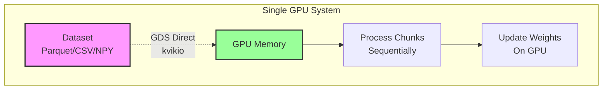
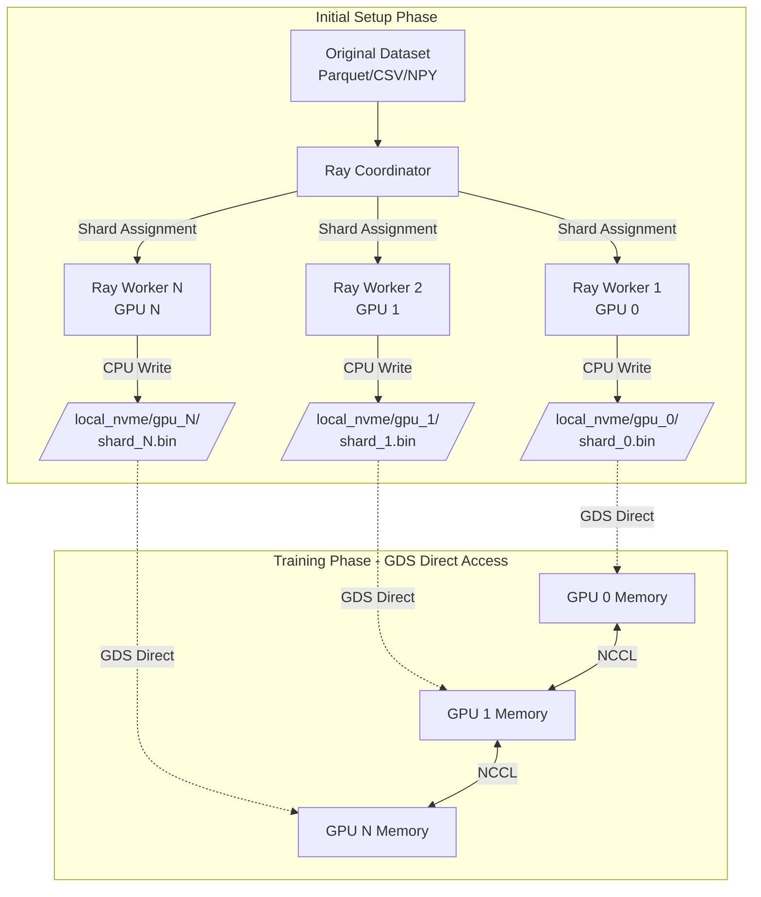
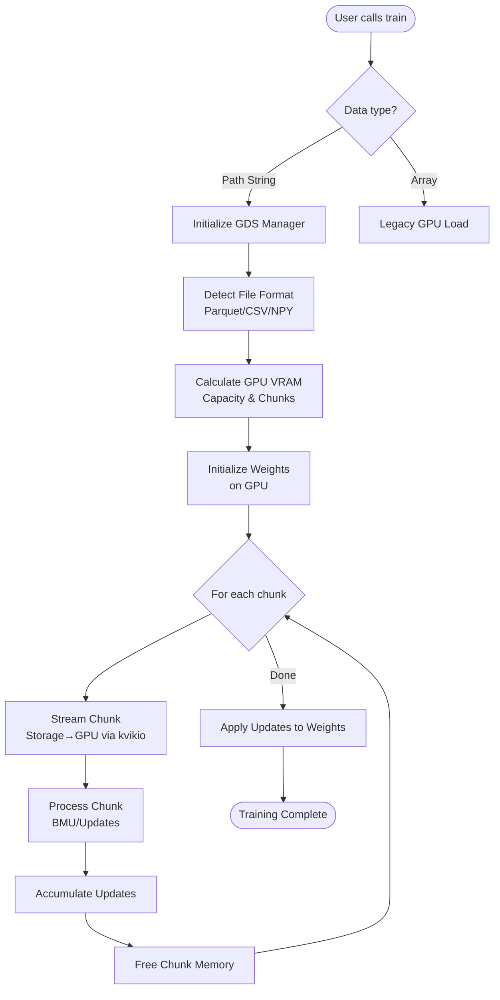

# GPUDirect Storage (GDS) Integration Project

## Executive Summary

This project implements direct storage-to-GPU data streaming using NVIDIA GPUDirect Storage (GDS) technology, enabling FloatSOM to process datasets significantly larger than GPU memory by completely bypassing CPU and system memory during data transfers.

### Key Features
- **Single-GPU Support**: Full GDS benefits for workstations and edge devices
- **Multi-GPU Scaling**: Seamless scaling with Ray orchestration
- **Mathematical Equivalence**: Colors processing maintains exact same algorithm and sample distribution
- **Zero-Copy I/O**: Direct storage-to-GPU transfers bypass CPU entirely

## Project Goals

1. **Enable larger-than-GPU-memory dataset processing** without CPU memory limitations
2. **Maximize I/O throughput** via direct storage-to-GPU paths for both single and multi-GPU setups
3. **Maintain backward compatibility** with existing in-memory processing
4. **Support multiple file formats** (Parquet, CSV, NumPy) via cuDF
5. **Provide consistent GDS benefits** for single-GPU workstations and multi-GPU clusters
6. **Scale efficiently** across multiple GPUs with Ray orchestration when available

## Architecture Overview

### Data Flow Comparison

#### Traditional Approach
```
Storage → CPU Memory → GPU Memory
         (bottleneck)
```

#### GDS Approach
```
Storage → GPU Memory (direct via PCIe/NVLink)
```

### High-Level System Architecture

#### Single-GPU Architecture


#### Multi-GPU Architecture


## Implementation Plan

### Phase 1: Core GDS Infrastructure

#### 1.1 GDS Data Manager (`floatsom/io/gds_manager.py`)

```python
class GDSDataManager:
    """
    Manages direct storage-to-GPU data streaming using kvikio/cuFile.
    
    Key responsibilities:
    - Auto-detect file formats (Parquet, CSV, NumPy)
    - Calculate optimal chunk sizes based on GPU VRAM
    - Stream data chunks directly to GPU memory
    - Handle fallback modes when GDS unavailable
    """
    
    def __init__(self, data_path: str, file_format: str = 'auto', 
                 chunk_size_mb: Optional[int] = None):
        """
        Initialize GDS manager with data path and configuration.
        
        Args:
            data_path: Path to data file or directory
            file_format: 'parquet', 'csv', 'npy', or 'auto' for detection
            chunk_size_mb: Manual chunk size in MB, auto-calculated if None
        """
        
    def calculate_gpu_capacity(self) -> Dict[str, int]:
        """
        Calculate available GPU memory and optimal chunk size.
        
        Returns:
            Dict with 'available_mb', 'chunk_size_mb', 'num_chunks'
        """
        
    def prepare_data_shards(self, num_gpus: int = 1) -> List[Dict]:
        """
        Prepare metadata for data sharding across GPUs.
        
        Returns:
            List of shard metadata dictionaries
        """
        
    def stream_chunk(self, chunk_id: int, gpu_id: int = 0) -> cp.ndarray:
        """
        Stream a data chunk directly from storage to GPU.
        
        Returns:
            CuPy array on specified GPU
        """
```

#### 1.2 Format Handler (`floatsom/io/format_handler.py`)

```python
class FormatHandler:
    """Handle different file formats with cuDF for GDS operations."""
    
    @staticmethod
    def detect_format(file_path: str) -> str:
        """Auto-detect file format from extension or content."""
        
    @staticmethod
    def read_chunk_gds(file_path: str, start_row: int, num_rows: int, 
                      format: str = 'auto') -> cp.ndarray:
        """
        Read data chunk using cuDF with GDS.
        
        Supports:
        - Parquet: Efficient columnar format
        - CSV: Text-based tabular data
        - NumPy: Binary array format
        """
```

### Phase 2: Configuration System

#### 2.1 GDS Configuration (`floatsom/floatsom_params.py`)

```python
@dataclass
class GDSConfig:
    """Configuration for GPUDirect Storage operations."""
    
    enable_gds: bool = True
    data_path: str = None
    file_format: str = 'auto'  # 'parquet', 'csv', 'npy', 'auto'
    chunk_size_mb: Optional[int] = None  # Auto-calculate if None
    prefetch_next: bool = True  # Async prefetch next chunk
    verify_gds: bool = True  # Verify GDS is working
    fallback_mode: str = 'cpu_streaming'  # Fallback if GDS fails
    storage_layout: str = 'single_file'  # 'single_file' or 'sharded'
    memory_safety_factor: float = 0.7  # Use 70% of available GPU memory
```

### Phase 3: Processor Updates

#### 3.1 Batch Processor with GDS (Single and Multi-GPU)

```python
class BatchProcessor(ProcessingMethod):
    """
    Enhanced batch processor with GDS streaming support.
    Works for both single-GPU and multi-GPU configurations.
    """
    
    def __init__(self, batch_config=None, ray_config=None, gds_config=None):
        """
        Initialize with optional GDS support.
        
        Args:
            batch_config: Batch processing configuration
            ray_config: Optional Ray configuration for multi-GPU
            gds_config: GDS configuration (used for both single and multi-GPU)
        """
        super().__init__()
        self.gds_config = gds_config
        self.use_ray = ray_config is not None
        
        if gds_config:
            # GDS enabled for both single and multi-GPU
            self.gds_manager = None  # Initialized when data path is provided
    
    def process_samples(self, samples_or_path, som_weights, topology, params):
        """
        Process samples from memory or directly from storage.
        
        Args:
            samples_or_path: Either numpy/cupy array or path to data file
            som_weights: SOM weights (remain on GPU)
            topology: SOM topology
            params: Training parameters
        """
        if isinstance(samples_or_path, str):
            # GDS path for both single and multi-GPU
            if self.use_ray:
                return self._process_ray_gds(samples_or_path, som_weights, 
                                            topology, params)
            else:
                return self._process_gds_streaming(samples_or_path, som_weights, 
                                                  topology, params)
        else:
            return self._process_memory_resident(samples_or_path, som_weights,
                                                topology, params)
    
    def _process_gds_streaming(self, data_path, som_weights, topology, params):
        """
        Process data directly from storage using GDS.
        
        Key steps:
        1. Initialize GDS manager
        2. Keep weights on GPU throughout
        3. Stream chunks sequentially
        4. Accumulate updates
        5. Apply final updates to weights
        """
```

#### 3.2 Colors Processor with GDS Streaming

```python
class ColorsProcessor(ProcessingMethod):
    """
    Enhanced colors processor with GDS streaming support.
    Maintains the same mathematical approach and sample distribution pattern.
    """
    
    def process_samples(self, samples_or_path, som_weights, topology, params):
        if isinstance(samples_or_path, str):
            # Use GDS streaming while maintaining same color set logic
            return self._process_gds_colors(samples_or_path, som_weights,
                                           topology, params)
    
    def _process_gds_colors(self, data_path, som_weights, topology, params):
        """
        Process color sets with GDS streaming.
        
        Maintains the same mathematical approach as in-memory processing:
        1. Stream chunks to build sample distribution
        2. Calculate color sets using same algorithm
        3. Process color sets with same round-based approach
        4. For multi-GPU: distribute samples identically to current method
        
        Key difference: Data is streamed from storage rather than memory-resident.
        Mathematical equivalence is preserved.
        """
        # Initialize GDS manager
        gds_manager = GDSDataManager(data_path, self.gds_config)
        
        # Stream samples for color set calculation
        # Uses same distribution pattern as current implementation
        samples_for_round = self._stream_round_samples(gds_manager, round_idx)
        
        # Calculate color sets (identical to current method)
        color_sets = self._calculate_color_sets(samples_for_round, som_weights, 
                                               topology, params)
        
        # Process color sets (identical logic)
        return self._process_color_sets(color_sets, samples_for_round, 
                                       som_weights, topology, params)
```

### Phase 4: Ray Multi-GPU Integration

#### 4.1 Ray GPU Worker with GDS

```python
@ray.remote(num_gpus=1)
class RayGPUWorker:
    """
    Ray worker managing one GPU with GDS access.
    
    Lifecycle:
    1. Initialize with GPU assignment
    2. Write data shard to local storage (one-time)
    3. Use GDS for all training reads
    4. Sync weights via NCCL
    """
    
    def __init__(self, gpu_id: int, node_id: int):
        self.gpu_id = gpu_id
        self.node_id = node_id
        self.local_storage_path = f"/local_nvme/gpu_{gpu_id}"
        self.gds_manager = None
        
        # Configure GDS
        os.environ['KVIKIO_COMPAT_MODE'] = 'OFF'
        
    def write_data_shard(self, data_indices, source_data):
        """
        One-time write of data shard to node-local storage.
        Uses CPU for initial write (Ray handles distribution).
        """
        
    def process_iteration_gds(self, som_weights, topology, params):
        """
        Process iteration using GDS streaming.
        All data reads bypass CPU completely.
        """
```

#### 4.2 Orchestration Pattern

```python
class RayGDSOrchestrator:
    """
    Orchestrates multi-GPU training with GDS.
    
    Pattern:
    1. Initial distribution (one-time CPU cost)
    2. GDS reads during training (repeated GPU-direct benefit)
    3. NCCL for weight synchronization
    """
    
    def distribute_data(self, dataset, num_gpus):
        """One-time data distribution across GPUs."""
        
    def train_with_gds(self, workers, num_epochs):
        """Training loop with GDS reads."""
```

## Single-GPU GDS Implementation

### Overview
GDS provides significant benefits even for single-GPU systems by:
- Eliminating CPU memory as a bottleneck
- Enabling processing of datasets larger than system RAM
- Reducing power consumption by bypassing CPU
- Providing consistent I/O performance

### Single-GPU Specific Benefits
1. **Desktop/Workstation Users**: Process large datasets on machines with limited RAM
2. **Development/Testing**: Same code path as production multi-GPU systems
3. **Edge Deployment**: Efficient processing on resource-constrained devices
4. **Prototyping**: Test GDS benefits before scaling to multi-GPU

### Implementation for Single GPU

```python
class SingleGPUGDSProcessor:
    """
    Optimized GDS processing for single-GPU systems.
    """
    
    def __init__(self, data_path: str, gds_config: GDSConfig):
        self.data_path = data_path
        self.gds_manager = GDSDataManager(data_path, gds_config)
        
        # Calculate optimal chunk size for single GPU
        gpu_memory = cp.cuda.Device(0).mem_info[0]
        self.chunk_size = int(gpu_memory * gds_config.memory_safety_factor)
        
    def process_dataset(self, som_weights, topology, params):
        """
        Stream and process entire dataset on single GPU.
        """
        # Weights stay on GPU
        gpu_weights = cp.asarray(som_weights)
        
        # Process each chunk
        for chunk_id in range(self.gds_manager.num_chunks):
            # Direct storage to GPU transfer
            chunk_data = self.gds_manager.stream_chunk(chunk_id, gpu_id=0)
            
            # Process chunk
            self._process_chunk(chunk_data, gpu_weights, topology, params)
            
            # Free chunk memory
            del chunk_data
            cp.get_default_memory_pool().free_all_blocks()
        
        return gpu_weights
```

## Data Flow Diagrams

### Single GPU Processing Flow



### Multi-GPU Ray + GDS Flow

```mermaid
flowchart TD
    Start([Multi-GPU Training]) --> Init[Ray.init()]
    Init --> Coord[Coordinator Calculates Shards]
    
    Coord --> Spawn[Spawn Ray Workers<br/>1 per GPU]
    
    Spawn --> ParWrite[Workers Write Shards<br/>In Parallel]
    ParWrite --> Barrier[Ray Barrier]
    
    Barrier --> Training[Training Loop]
    
    subgraph "GDS Training Phase"
        Training --> GDSRead[Workers Read via GDS]
        GDSRead --> Process[Process on GPUs]
        Process --> NCCL[NCCL Weight Sync]
    end
    
    NCCL --> Check{More Iterations?}
    Check -->|Yes| Training
    Check -->|No| End([Complete])
```

## Storage Layout

### Directory Structure

```
/local_nvme/                     # Node-local NVMe storage
│
├── node_0/                      # Node 0 storage
│   ├── gpu_0/                   # GPU 0 dedicated directory
│   │   ├── shard_0.bin          # Binary data shard
│   │   ├── metadata.json        # Shard metadata
│   │   └── chunk_index.json     # Chunk boundaries
│   │
│   └── gpu_1/                   # GPU 1 dedicated directory
│       ├── shard_1.bin
│       ├── metadata.json
│       └── chunk_index.json
│
└── node_1/                      # Node 1 storage
    ├── gpu_2/
    └── gpu_3/
```

## Memory Management

### GPU Memory Layout

```
GPU VRAM (24GB Example)
├── SOM Weights (500MB) - Persistent
├── Active Data Chunk (2GB) - Streaming
├── Working Memory (1GB) - BMUs, Influence
└── Free Memory (20.5GB) - Buffer
```

### Chunking Strategy

1. **Query GPU Memory**: Get available VRAM
2. **Reserve Working Space**: Weights + computation buffers
3. **Calculate Chunk Size**: Remaining memory * safety factor
4. **Stream Sequentially**: One chunk at a time

## Implementation Phases

### Phase 1: Core Infrastructure (Week 1-2)
- [ ] Implement GDSDataManager
- [ ] Create FormatHandler
- [ ] Add GDSConfig to parameters
- [ ] Basic testing with single GPU

### Phase 2: Processor Integration (Week 2-3)
- [ ] Update BatchProcessor for GDS
- [ ] Add streaming mode detection
- [ ] Validate chunked processing

### Phase 3: Multi-GPU Support (Week 3-4)
- [ ] Update Ray workers for GDS
- [ ] Implement local shard writing
- [ ] Test NCCL synchronization
- [ ] Benchmark multi-GPU throughput

### Phase 4: Testing & Optimization (Week 4-5)
- [ ] Verify CPU bypass with monitoring
- [ ] Compare GDS vs traditional performance
- [ ] Optimize chunk sizes
- [ ] Document configuration guidelines

## Testing Strategy

### Functional Tests
1. **Format Detection**: Verify auto-detection of Parquet/CSV/NPY
2. **Chunking**: Validate chunk boundaries and completeness
3. **Equivalence**: Compare GDS vs in-memory results
4. **Fallback**: Test behavior when GDS unavailable

### Performance Tests
1. **Throughput**: Measure GB/s for different file formats
2. **CPU Usage**: Verify CPU bypass is working
3. **Scalability**: Test with 1, 2, 4, 8 GPUs
4. **Memory Usage**: Confirm staying within limits

### Integration Tests
1. **End-to-end**: Full training pipeline with GDS
3. **Ray Integration**: Multi-node deployment
4. **HDSSSOM**: Compatibility with selector callbacks

## Configuration Examples

### Single GPU with GDS

```python
from floatsom import FloatSOM
from floatsom.floatsom_params import GDSConfig

gds_config = GDSConfig(
    enable_gds=True,
    file_format='parquet',
    chunk_size_mb=2048,  # 2GB chunks
    verify_gds=True
)

som = FloatSOM(
    grid_size=(100, 100),
    gds_config=gds_config
)

# Pass file path instead of loading data
som.train('data/large_dataset.parquet')
```

### Multi-GPU with Ray

```python
import ray
from floatsom import FloatSOM

ray.init(num_gpus=4)

som = FloatSOM(
    grid_size=(200, 200),
    use_ray=True,
    num_gpus=4,
    gds_config=GDSConfig(enable_gds=True)
)

# Ray handles distribution, GDS handles I/O
som.train('data/huge_dataset.parquet')
```

## Performance Expectations

### Single GPU
- **Traditional**: 500 MB/s (CPU bottleneck)
- **GDS**: 10-25 GB/s (NVMe speed)
- **Speedup**: 20-50x for I/O bound workloads

### Multi-GPU (4x A100)
- **Traditional**: 500 MB/s shared
- **GDS**: 40-100 GB/s aggregate
- **Speedup**: 80-200x for I/O bound workloads

## Known Limitations

1. **File Formats**: Currently supports Parquet, CSV, NPY
2. **Storage Requirements**: Needs local NVMe for best performance
3. **GPU Memory**: At least 2GB free VRAM required for chunking
4. **Initial Setup**: Multi-GPU requires one-time CPU-based data distribution

## Future Enhancements

1. **Async Prefetching**: Overlap I/O with computation
2. **Compression Support**: Handle compressed formats
3. **Dynamic Chunking**: Adapt chunk size based on workload
4. **Cloud Storage**: Support for S3/GCS with GDS

## References

- [NVIDIA GDS Documentation](https://docs.nvidia.com/gpudirect-storage/)
- [KvikIO Documentation](https://docs.rapids.ai/api/kvikio/stable/)
- [cuDF I/O Guide](https://docs.rapids.ai/api/cudf/stable/user_guide/io/io/)
- [Ray Documentation](https://docs.ray.io/)

## Appendix: Environment Setup

### Required Software
```bash
# CUDA 11.4+ with GDS
# nvidia-fs kernel module
# kvikio library
# cuDF for file format support

# Installation
conda install -c rapidsai -c conda-forge kvikio cudf
pip install ray[default]

# Verify GDS
export KVIKIO_COMPAT_MODE=OFF
python floatsom/benchmarks/gds_test.py
```

### Environment Variables
```bash
# Force GDS mode
export KVIKIO_COMPAT_MODE=OFF

# Enable parallel access
export CUFILE_PARALLEL_ACCESS=1

# Increase buffer size
export CUFILE_BUFFER_SIZE=268435456  # 256MB

# Debug logging
export CUFILE_ENV_LOG_LEVEL=6
```

## Contact

For questions or issues related to this implementation:
- Technical Lead: [Your Name]
- Project Repository: [GitHub URL]
- Documentation: This document