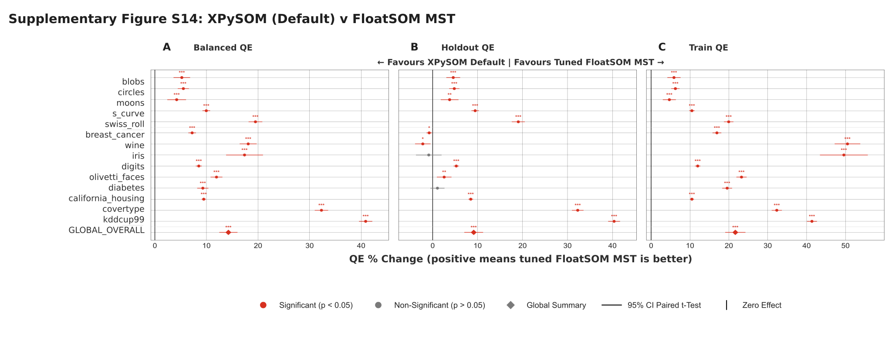

# Floatsom Paper

## Title

FloatSOM: Topology-Flexible, OOM-Capable, Multi-GPU Self-Organizing Maps

## Authors

Anonymous Authors

## Abstract

FloatSOM is a GPU-oriented suite for Self-Organizing Maps (SOMs) designed for large-scale training and deployment. The framework combines algorithmic optimization, sampling-strategy analysis, flexible topology support (hexagonal, minimum-spanning-tree (MST), and relative-neighbourhood graph (RNG)), and hyperparameter optimization. It supports multi-GPU execution and out-of-memory training through disk-backed streaming while extending SOM topology choices beyond regular lattices. We also evaluate when reduced-sampling regimes are practically appropriate. Taken together, these results define operating regimes for SOM deployment under different quality-throughput constraints. In our largest benchmark, FloatSOM trains a 1024-node network on 1 billion samples with 50 features in about 6 minutes.

## 1. Introduction

Self-Organizing Maps (SOMs), originally introduced by Kohonen [@kohonenSelforganizingMap1990], learn a neighborhood-preserving map of prototype-node interactions that provides a topology-aware low-dimensional representation of high-dimensional data. In practice, SOMs are commonly used to map dataset topology, produce dimensionality-reduced representations, and support downstream clustering at scale. As dataset size and heterogeneity increase, these use cases become increasingly sensitive to training throughput and memory scaling. GPUs are therefore central to modern SOM deployment, yet many implementations remain constrained to single-device in-VRAM workloads and fixed lattice neighborhoods (most commonly hexagonal or rectangular grids), with limited support for multi-GPU/out-of-core execution, flexible graph topologies, and principled hyperparameter optimization. This manuscript examines four related areas in that setting: sampling strategy, topology flexibility beyond fixed lattices, multi-GPU and OOM-capable execution beyond single-device VRAM limits, and data-backed hyperparameter optimization. Because sampling strategy directly affects the practical quality-throughput tradeoff, we evaluate full, random, and HDSSSOM sampling under matched optimization settings, with detailed sampling methodology and literature context provided in Section 2.1.

At the systems level, we implement a multi-GPU, multi-node training method using Ray actor orchestration with NCCL collectives, enabling direct GPU-to-GPU communication in environments that support this path. We also implement an OOM-resilient disk-streaming data path through a custom loader for data staging and transfer between storage and GPU memory. In this setting, trainable SOM workload size is shaped primarily by available storage and I/O throughput rather than aggregate VRAM alone. Although this execution stack is tuned for HPC operation, we also report runs on consumer-grade desktop GPUs in non-HPC environments.

Our experimental program centers on five outcomes:
1. Above 10,000 samples, full and random sampling show little paired $QE$ separation, whereas smaller datasets show greater instability under random sampling,
2. MST and RNG topologies achieve lower $QE$ than hexagonal baselines,
3. Tuned Default runs outperform matched untuned defaults,
4. MST and RNG show lower hyperparameter-stability scores than hexagonal near optimum regions,
5. The execution stack supports multi-GPU, multi-node training with OOM-safe disk streaming at scale.
Quality comparisons use $QE$ as the primary endpoint because distortion is not defined for MST in this setup.

## 2. Related Work

Sampling strategies in SOM pipelines are primarily motivated by computational efficiency. Full-data training can be expensive for large or high-dimensional datasets, so the practical objective is to approximate the effect of training on the full dataset while processing fewer observations. When the sampled data remain sufficiently representative, this can preserve map quality while reducing wall-clock time. This quality-throughput tradeoff is why sampling methodology is a first-order design choice in scalable SOM workflows.

### 2.1 Sampling Methodologies for SOM Training

Within that acceleration framing, random sampling in SOM pipelines is used in two common schemas. In the fixed-subset schema, a random subset is sampled once up front and reused throughout training; this is the strategy used in scalable pixel-level clustering for a biological application and relies on the assumption that the selected subset remains representative of the full dataset [@liuRobustPhenotypingHighly2023]. In the iteration-resampled schema, each training iteration receives a new random draw from the full dataset, using probabilistic coverage across iterations to approximate full-data exposure; this second mode is explicitly discussed in Kohonen's standard SOM treatment as often sufficient in practical settings [@kohonenSelfOrganizingMaps2001].

Beyond naive random sampling, additional methods have aimed to improve quality-time tradeoffs through guided subset selection. A prominent example is HDSSSOM [@wetmoreSpeedingSelfOrganizingFeature2005], which is one of the few approaches with publicly available implementations. We re-implement HDSSSOM in the present workflow and evaluate numerically the advantages and disadvantages of fixed/full/random/intelligent sampling strategies relative to full sampling.

### 2.2 Python SOM Implementations

Classical Python SOM usage has been influenced by MiniSom-style interfaces [@vettigliJustGlowingMinisom2026]. Within this ecosystem, XPySOM is a high-performance Python implementation and a useful contextual reference for batch-SOM behavior. XPySOM is explicitly described as a batch SOM derived from MiniSom with NumPy/CuPy backends, and reports algorithm-level optimization and acceleration in single-process execution while maintaining competitive $QE$ behavior [@manciniXPySomHighPerformanceSelfOrganizing2020].

We do not include MiniSom as a full benchmark baseline in the remaining experiments. This scope choice is based on two factors: prior literature already supports the expected batch-SOM behavior for this class of implementation, and MiniSom runtime becoming prohibitive at our target scale of millions of samples. Using iteration-matched training semantics, the standard benchmark configuration used in this manuscript, with $10^7$ samples, 50 dimensions, a $32 \times 32$ grid, and 10 iterations, requires MiniSom more than 12 hours to complete, making it impractical for the full comparative campaign.

### 2.3 Topology Flexibility and Systems Gap

Most practical high-throughput SOM implementations focus on regular lattice neighborhoods (rectangular/hexagonal), which simplify neighborhood indexing and vectorized updates. We support both grid and hexagonal regular lattices; however, following prior SOM literature, we treat hexagonal as the standard regular-topology baseline because its neighborhood geometry is typically more isotropic and tends to reduce directional lattice bias relative to rectangular grids [@kohonenEssentialsSelforganizingMap2013; @forestSurveyImplementationPerformance2020a]. 

Graph-structured neighborhoods, however, have long been discussed in SOM literature. In particular, early SOM work by Kangas, Kohonen, and colleagues explicitly proposed defining neighborhoods via a minimum spanning tree and argued that this can provide a better approximation than fixed lattices for strongly structured densities [@kangasVariantsSelforganizingMaps1989]. To our knowledge, no MST implementation of SOMs are presently available openly. In FloatSOM, we implement that MST neighborhood proposal as a train-time topology.

We also study proximity-graph neighborhoods using Relative Neighborhood Graphs (RNGs) [@toussaintRelativeNeighbourhoodGraph1980]. In the standard RNG construction, two prototypes are connected when no third prototype lies closer to both endpoints than the endpoints are to each other under the blocker criterion. This yields a geometry-driven sparse graph that can preserve local neighborhood relations without imposing a tree constraint. RNG was therefore a natural second non-lattice topology to investigate alongside MST, allowing evaluation of whether SOM training benefits from additional local routes beyond a tree while remaining grounded in prototype geometry.

More broadly, alternatives to lattice-based SOM topologies do exist, but they have generally not been developed into scalable high-performance implementations. One reason they are used less often in practice is that they are typically more complex to construct and update than regular lattices, and this additional complexity can scale poorly as dataset size, neuron count, or systems throughput requirements increase. As a result, currently available distributed and other throughput-oriented SOM systems remain largely restricted to regular lattice topologies, especially rectangular and hexagonal grids, and non-lattice topologies remain difficult to evaluate at real-world data scales.

### 2.4 XPySOM Compared to FloatSOM 

We use XPySOM as a contextual reference for batch-SOM behavior to establish equivalence with current state-of-the-art[@manciniXPySomHighPerformanceSelfOrganizing2020]. FloatSOM and XPySOM share the same core batch-update structure, and the same mathematical principles in the training algorithm, but differ in implementation. 

The XPySOM implementation follows a single-process NumPy/CuPy design with local chunk-level parallelism. Its batch update forms per-sample neighborhood weights and applies normalized updates with zero-denominator protection. By design, it does not include distributed collectives, multi-GPU actor orchestration, or out-of-core data loading. In contrast, our batch pipeline builds on this optimized batch-SOM foundation while adding JIT-compiled GPU-kernel paths plus bounded-memory chunked execution for OOM-resilient operation, and is embedded in a Ray+NCCL distributed runtime with explicit multi-GPU synchronization and topology-aware extensions (MST/RNG).

Accordingly, the work evaluated in this manuscript is not limited to kernel-level acceleration, but extends batch SOM to multi-GPU worker groups, disk-backed loading, bounded-memory chunking, and recovery-oriented execution paths. XPySOM is treated as a contextual reference for batch-update mechanics in the calibration analyses, while the final integrated comparison is framed as a deployment comparison against a current high-performance Python SOM baseline rather than as an ablation-style algorithm-isolation study.

### 2.5 Hyperparameter Optimization with TPE

Modern hyperparameter optimization workflows increasingly use Tree-structured Parzen Estimator search, including Optuna's TPE-based optimization framework [@akibaOptunaNextgenerationHyperparameter2019a]. In this work, we use TPE-driven optimization to derive hyperparameter sets for each FloatSOM configuration. The effective optimum depends on the selected topology, sampling regime, and processing mode, so tuning is treated as part of the evaluation pipeline rather than as a fixed post hoc setting. This methodology also allows for the examination of the theoretical 'optimum' that each configuration can attain, with their respectively optimised parameter sets. This enables disentanglement of advantages gleaned due to architectural changes as opposed to mere hyperparameter appropriateness. 

## 3. Methods

We present the methods in the same order as the results: sampling strategy, topology innovations (MST and RNG), followed by systems acceleration methodologies. Section 3.1 defines sampling selector mathematics, Section 3.2 defines MST, Section 3.3 defines RNG, and Section 3.4 describes the multi-GPU and OOM-capable execution stack used to run these algorithms at scale. Standard SOM primitives are assumed from prior literature and are not re-derived here.

### 3.1 Sampling Selector Mathematics

This section formalizes the sampling policies evaluated in this work.

Let the full dataset be $X=\{x_i\}_{i=1}^{N}$. The per-iteration sampling budget $m$ is either fixed directly or determined as a proportion $\rho$ of the dataset:
$$
m=
\begin{cases}
m_0, & \text{if a fixed budget is specified},\\[4pt]
\max\!\left(1,\left\lfloor N\rho \right\rfloor\right), & \text{if a dataset proportion is used}.
\end{cases}
\tag{1}
$$

For index sets $\mathcal{I}_t^{(s)}$ at iteration $t$, the implemented full and random selectors are:
$$
\mathcal{I}_t^{\mathrm{full}}=\{1,\dots,N\},
\qquad
\mathcal{I}_t^{\mathrm{random}} \sim \mathrm{Unif}\!\left(\left\{I\subseteq\{1,\dots,N\}:|I|=m\right\}\right),\ m<N.
\tag{2}
$$
If $m\ge N$, random returns the full dataset (no subsampling). The selected training batch is $X_t^{(s)}=\{x_i:i\in\mathcal{I}_t^{(s)}\}$.

For random subsampling, the per-iteration objective is aligned in expectation with full-data risk:
$$
\mathbb{E}_{\mathcal{I}_t^{\mathrm{random}}}\!\left[\frac{1}{m}\sum_{i\in\mathcal{I}_t^{\mathrm{random}}}\ell(x_i;W)\right]
=
\frac{1}{N}\sum_{i=1}^{N}\ell(x_i;W).
\tag{3}
$$

For HDSSSOM [@wetmoreSpeedingSelfOrganizingFeature2005], the dataset is partitioned into contiguous blocks, and each iteration ranks those blocks using a normalized combination of difficulty dispersion and sample age. Candidate exemplars are then drawn from the highest-scoring blocks using the same difficulty-age logic, with randomized top-score selection to preserve exploration. If this candidate pool exceeds the target budget $m$, the selector downsamples uniformly without replacement to return exactly $m$ samples. The core algorithm is kept from the original publication, and re-implemented here to be multi-GPU compatible. 

After BMU evaluation, processed samples update their stored difficulty through an exponentially decayed moving average of BMU distance and reset their age, while unprocessed samples retain their previous difficulty and continue aging. This recency-weighted difficulty tracking is the key mechanism by which HDSSSOM preferentially revisits hard or stale regions of the dataset.

### 3.2 MST Topology Implementation

We next define the first topology contribution: MST neighborhoods computed from prototype geometry rather than fixed lattice adjacency. For regular-lattice baselines, we support both grid and hexagonal layouts, but we treat hexagonal as the standard topology reference in this manuscript based on prior SOM guidance regarding neighborhood isotropy and reduced directional bias [@kohonenEssentialsSelforganizingMap2013; @forestSurveyImplementationPerformance2020a].

MST topology replaces fixed lattice neighborhood distance with graph shortest-path distance on a minimum spanning tree built from current prototypes. For $P$ prototype nodes in feature dimension $d$, the pairwise prototype matrix is formed with the standard squared-distance Gram identity, which avoids 3D broadcast tensors and preserves $O(P^2 d)$ dense linear-algebra structure.

After distance construction, MST edges are extracted by CPU Kruskal, adjacency is built, and all-pairs graph distances are computed via chunked GPU Floyd-Warshall [@kruskalShortestSpanningSubtree1956; @floydAlgorithm97Shortest1962; @warshallTheoremBooleanMatrices1962]. The row chunk size is resolved from memory-budget controls to bound temporary allocations. Learning-time neighborhood influence is then evaluated on graph distances with the standard Gaussian neighborhood kernel. To amortize repeated topology queries, radii are deduplicated using a 10% threshold and influence matrices are cached by radius and influence function, with topology refresh handled by fixed or progress-adaptive update frequency.

Under this refresh policy, the topology path is simple: if the current iteration does not trigger recomputation, the previous graph state and cached influences are reused; otherwise, pairwise prototype distances are rebuilt on GPU, the MST is recomputed on CPU, graph distances are refreshed in chunked GPU fashion, and the influence cache is rebuilt for the deduplicated active radii.

```text
Input: prototypes W_t, iteration t, topology-refresh policy
Output: topology state (E_t, g_t, cached influences)
1: Query the refresh policy for the current iteration
2: if no topology refresh is due then
3:     return previous topology state
4: end if
5: Compute pairwise squared prototype distances on GPU
6: Transfer distances to CPU and run Kruskal to obtain MST edges E_t
7: Build adjacency from E_t
8: Compute all-pairs graph distances g_t with chunked GPU Floyd-Warshall
9: Deduplicate active radii and rebuild/update cached influence maps
10: Commit E_t, g_t, and cache state
11: return topology state
```
*Algorithm 3. Dynamic MST topology update with refresh-triggered recomputation and cached influence reuse.*

### 3.3 RNG Topology Implementation

RNG is our second topology contribution. RNG topology constructs a Relative Neighborhood Graph over current prototype distances using the standard RNG criterion [@toussaintRelativeNeighbourhoodGraph1980], and then reuses the MST infrastructure for shortest-path precomputation, radius-deduplicated influence caching, and dynamic update scheduling.

Candidate elimination is evaluated in chunks to control memory pressure while preserving the direct strict blocker test. No post-hoc connectivity repair is applied after edge extraction; the topology is defined entirely by the canonical RNG criterion.

### 3.4 Multi-GPU + OOM Methodology and Implementation

After defining the algorithmic components, we describe the execution system used in experiments. This section covers how we distribute computation across GPUs, how data are streamed for large workloads, and how memory safeguards preserve progress under high-pressure regimes.


*Figure 1. Multi-GPU data-loader and NCCL synchronization schematic. Solid disk-backed path: data are distributed from shared storage to worker-local shards on node-local storage, streamed in chunks into pinned host memory, transferred with overlapped loading/compute CUDA streams, processed as chunked local BMU/update steps, synchronized by NCCL all-reduce, and normalized into iteration-level weight updates. Dotted path: RAM mode, where data are sharded directly into each worker's GPU-local CPU RAM and fed to GPU staging without disk-read queueing; this path is typically faster when data are already memory-resident because disk-read overhead is removed.*

#### 3.4.1 General Multi-GPU Logic

Distributed execution uses Ray actors with one GPU per worker and NCCL collectives for synchronous aggregation [@moritzRayDistributedFramework2018]. Each worker computes local update/influence accumulators, followed by global summation.

For worker $g \in \{1,\dots,G\}$, let $X_{t,g}^{(s)}$ denote the worker-local shard of the selected iteration batch $X_t^{(s)}$. The local accumulators are:

$$
\begin{aligned}
U_j^{(g)} &= \sum_{x \in X_{t,g}^{(s)}} \eta_t\,h_{j,b(x)}^{(t)}(x-w_j), \\
H_j^{(g)} &= \sum_{x \in X_{t,g}^{(s)}} h_{j,b(x)}^{(t)}.
\end{aligned}
\tag{4}
$$

Global synchronized accumulators are:

$$
\begin{aligned}
U_j &= \sum_{g=1}^{G} U_j^{(g)}, \\
H_j &= \sum_{g=1}^{G} H_j^{(g)}.
\end{aligned}
\tag{5}
$$

Normalization and momentum are then applied with globally consistent denominators. Weights remain resident on worker GPUs across iterations, and the driver exchanges lightweight metadata rather than full weight tensors except when an explicit topology refresh fetch is required.

#### 3.4.2 Multi-GPU Implementation Details

The execution stack centers on a worker-local CPU-to-GPU staging pipeline coupled to distributed iteration control. Data placement is mode-specific (Fig. 1): in RAM mode, data are pre-sharded directly into each worker's GPU-local CPU RAM; in streaming mode, data are distributed to worker-local disk shards and then consumed through a bounded chunked loader. This disk-backed path is the primary OOM mechanism for large workloads. In both cases, data are staged in bounded chunks rather than materialized as full-device arrays, and pinned host buffers are used to make host-to-device transfer deterministic at slot granularity.

The synchronous path uses predictive prefetch and bounded in-memory queueing so loading stays aligned to actual training consumption without allowing host-memory growth to run away under large workloads. For distributed in-RAM execution, the same chunk-first principle is applied with bounded queue capacity and priority handling for imminent compute chunks.

For large neuron grids in graph topologies (MST/RNG), topology-side distance and influence structures are also memory-aware: when node count exceeds the CPU-offload threshold, graph-distance matrices and cached influence maps are stored on CPU and transferred back to GPU on demand. Consequently, both data ingestion and topology-state management are executed in chunked/disk-backed fashion under high memory pressure.

GPU transfer/compute overlap is implemented as a multi-buffer stream pipeline controlled by CUDA events. In steady state, one slot can be under compute while another is under host-to-device transfer and a third is in lookahead prefetch. NCCL synchronization remains synchronous SUM all-reduce over update and influence tensors per iteration, with dtype and contiguity normalization to keep collective signatures identical across ranks. The resulting system combines dual-mode CPU queueing, slot-safe pinned staging, and event-governed multi-buffer GPU pipelining while preserving OOM-safe operation at scale.

This end-to-end configuration is illustrated in Fig. 1. The solid branch corresponds to the bounded-memory chunk path used when full data cannot be resident in GPU memory: shard to node-local storage first, then stream into pinned-memory/H2D staging. The dotted branch denotes RAM mode: shard directly to each worker's GPU-local CPU RAM, skip disk-read queueing, and feed chunks into the same pinned-memory/H2D staging pipeline. When source data are already memory-resident, this RAM branch is preferred because it removes disk-read overhead.

#### 3.4.3 OOM-Capable Strategy

OOM robustness is implemented through two primary chunking controls. First, data chunking processes datasets in bounded sample chunks from disk-backed storage or distributed host memory, so training can proceed even when full data do not fit in device memory. Second, grid chunking processes large neuron-grid computations in bounded tiles/chunks, keeping topology-side distance and influence operations within memory budgets.

#### 3.4.4 XPySOM vs FloatSOM batch comparison

To quantify batch-update agreement in practice, we ran a direct XPySOM-versus-FloatSOM benchmark under matched settings, with the grid fixed to 32x32 and a training budget of 20 epochs over 10 seeds. The run used hexagonal topology and full-batch updates.

## 4. Experimental Setup

### 4.1 Datasets and preprocessing

We use two benchmark protocols: an Optuna quality benchmark and a speed-scaling benchmark. The first evaluates algorithmic quality, and the second evaluates runtime scaling.

#### 4.1.1 Optuna benchmark datasets

The Optuna quality benchmark uses a mixed synthetic/real dataset suite to expose the algorithm to a broad range of challenges and verify stable behavior across distinct data regimes. Synthetic datasets include: *swiss_roll, moons, circles, blobs, s_curve*, and real datasets include: *breast_cancer, wine, iris, digits, olivetti_faces, diabetes, california_housing, covertype, kddcup99*. Synthetic datasets are generated in accordance with the random seed selected, while real-world datasets are loaded from sklearn with native sample-feature structure. Across the Optuna protocol, inputs are standardized, [@nishinoCupyNumpycompatibleLibrary2017], and evaluated with deterministic seeded permutations and a fixed 70/30 train-holdout split.

#### 4.1.2 Scaling benchmark datasets

The speed-benchmark protocol uses synthetic random matrices with uniform values in $[0,1]$ and evaluates scaling under controlled sample-size sweeps. Data are represented in `float32` and streamed through the same training data path used by the benchmark runtime pipeline. Sampling selector mathematics for full, random, and HDSSSOM is defined in Section 3.1. In this experimental setup, these same three modes are available in the Optuna pipeline; in the speed-scaling experiments reported here, sampling is fixed to full.

### 4.2 Metrics

Our primary quality metric is Quantization Error ($QE$), computed in the standard way with GPU distance kernels. We report both train and holdout $QE$, denoted $QE_T$ and $QE_H$, respectively. Here, $QE_T$ captures use cases where the full observed population is available and the map is intended to represent that same population, while $QE_H$ captures generalization settings where the trained SOM is projected onto previously unseen samples.

Balanced $QE$, denoted $QE_B$, is defined as the mean of $QE_T$ and $QE_H$:
$$
QE_B=\frac{QE_T+QE_H}{2}.
\tag{6}
$$
$QE_B$ is therefore a composite endpoint that weights representation fidelity (train) and transfer-to-unseen-data fidelity (holdout) equally. Unless stated otherwise, we report raw (non-normalized) $QE_B$. In the executed Optuna $QE$ runs with split-aware evaluation, $QE_T$ and $QE_H$ are optimized jointly as a two-objective vector. 

### 4.3 Optuna protocol (topology and sampling campaign)

All production Optuna and speed benchmarks reported in this manuscript were executed on NCI Gadi (National Computational Infrastructure, Australia) gpuvolta nodes [@HPCSystemsNCI], using a consistent multi-GPU environment across runs. The main Optuna campaign evaluates all three topology families (hexagonal, MST, RNG) under the full and random sampling regimes, with seed-matched trials and split-aware objective evaluation. A separate focused HDSSSOM pilot is reported in Section 5.2. 

We use Optuna-based hyperparameter optimization because achieved $QE$ depends materially on hyperparameter choice (Section 5.5). The goal is to estimate near-optimal attainable performance under a common bounded search budget rather than untuned behavior. Hyperparameter search is run with configuration constraints that depend on the selected algorithmic variant, including sampling and topology context, so comparisons remain consistent across datasets while allowing variant-appropriate tuning spaces. For regular-lattice runs, we support both grid and hexagonal layouts while still treating hexagonal as the standard regular-topology reference.

The executed analysis corresponds to $14_{Datasets} \times 200_{Trials} \times 10_{Seeds} \times 3_{Topologies} \times 2_{SampleMethods} = 168,000$ SOM runs. We chose to replicate each benchmark 10 times using different seeds to ensure robust results. Batch mode is fixed to full-batch training in this protocol for the benchmark results reported in this manuscript. Operationally, this Optuna campaign uses the standard in-memory batch path rather than the Ray-distributed execution stack due to dataset size not requiring Ray.

Sampling comparisons in Section 5.2 use the hexagonal subset of this campaign for full-vs-random paired analyses, and include a focused full-vs-HDSSSOM pilot comparison under matched settings. Topology comparisons in Sections 5.3-5.4 use full-sampling runs across hexagonal, MST, and RNG and include all available full-sampling datasets in this subset (no dataset-size exclusion for Figures 4-5). Unless explicitly stated otherwise, the remaining analyses reported in this manuscript use full sampling with full-batch training.

### 4.4 Speed benchmark protocol

Speed scaling is evaluated with harmonized runs across $G\in\{1,2,4,8\}$ GPUs under a fixed sample-scaling protocol. Runtime summaries are computed from repeated executions per configuration and reported as both absolute training time and topology runtime ratios. These scaling and multi-GPU/OOM-capable runs use the Ray-orchestrated distributed execution layer built on top of the standard FloatSOM training path [@moritzRayDistributedFramework2018]. Accordingly, the scaling figures in Sections 6.1-6.2 and the runtime/scaling comparison reported later against XPySOM should be interpreted as distributed-execution results rather than the in-memory Optuna path. 

For scaling-efficiency calculations, when a single-GPU baseline was missing at a given axis value due to timeout, we estimated that baseline by local linear extrapolation from the last available 1-GPU point on the same curve. That is, runtime was assumed to scale proportionally with the axis variable for the extrapolation step (for example, doubling sample count or doubling dimensionality doubles the estimated 1-GPU runtime). This assumption was used only to construct missing 1-GPU baselines for speedup/efficiency reporting and did not alter the observed multi-GPU runtime traces.

Topology-speed comparisons include hexagonal, MST, and RNG, with harmonized workload settings so ratios isolate topology-associated runtime effects.

Unless explicitly stated otherwise, speed benchmarking is reported under full sampling. A dedicated random-versus-full speed comparison is additionally reported at 1 GPU (batch mode) to isolate sampling runtime effects independent of multi-GPU scaling.

Compute resources are scaled with GPU count while keeping the software environment and benchmark procedure consistent across runs. For scaling benchmarks, each run was terminated at a wall-clock timeout of 30 minutes (timeout). Per-GPU resource allocation was fixed at 12 CPU cores, 90 GB system RAM, and 32 GB VRAM.

### 4.5 Statistical analysis

All Optuna comparisons were paired because the experimental design contains substantial between-run heterogeneity arising from dataset, seed, and split structure. Pairing therefore allows each comparison to be evaluated within a matched experimental context. 

Pairs were defined within matched dataset, seed, and split units, while holding all non-target descriptors fixed and varying only the factor under study; batch mode was included as an additional matching constraint when relevant. Within each matched unit, trials were ranked by the target metric, the top five were retained, and each condition was summarized by the median of those retained trials. This summary is intended to estimate near-optimal attainable performance under the common Optuna budget rather than average behavior across all explored hyperparameter settings. Paired effects were then computed as simple condition differences, with negative values favoring the first condition for lower-is-better metrics.

Dataset-level forest and effect summaries report mean paired effects. Two-sided paired one-sample $t$-tests on the paired summary effects are used as a directional inferential summary around the mean paired effect, and forest-plot whiskers show the corresponding 95% confidence intervals. We use this paired $t$-test because the estimand in the forest plots is the mean paired effect and each dataset contributes multiple matched pairs under the executed design.

Global aggregate summaries use the same paired $t$-test framework. The single global row is tested with a two-sided paired one-sample $t$-test on the paired effects contributing to that aggregate, together with the corresponding 95% confidence interval around the mean paired effect. The same paired $t$-test summary is used for top-$k$ sensitivity analyses. In this manuscript, wording such as "no detected difference" means failure to reject at the stated threshold under this paired $t$-test pipeline; it is not a formal equivalence claim.

### 4.6 Tuned Default-versus-untuned Default Analysis

To quantify parameter-tuning benefit, we performed an explicit Tuned Default-versus-untuned Default paired analysis on seed-preserving Optuna exports. Pairing was defined within matched dataset, seed, optional split, topology, processing mode, sampling mode, and batch-mode units. Within each matched unit, the untuned comparator was the earliest completed trial and the Tuned Default comparator was the best trial by the target metric. This analysis therefore estimates the gain obtainable from bounded hyperparameter search relative to an untuned default within each matched context. We report both the default-minus-tuned difference, so positive values favor the Tuned Default condition for lower-is-better metrics, and the percent improvement relative to the default value.

Dataset-wise Tuned Default-versus-untuned Default summaries use two-sided paired one-sample $t$-tests, with forest-plot whiskers showing 95% confidence intervals around the mean paired effect. The global overall summary pools all matched Tuned Default/untuned default pairs across datasets and applies the same paired $t$-test and confidence-interval construction to that pooled paired set.

### 4.7 Hyperparameter stability and dataset-type stratification

Hyperparameter stability was evaluated from tuned top-1 trials selected separately per seed and topology within matched dataset, processing, sampling, and optional split units. We then compared within-topology seed-to-seed parameter variation and contrasted those stability scores between topology pairs.

For numeric parameters, stability was measured across within-topology seed pairs using the relative difference
$$
\frac{|a-b|}{\max(|a|,|b|,\varepsilon)},
$$
with $\varepsilon=10^{-12}$, and then averaged over the compared numeric parameters; lower values indicate higher stability. For categorical parameters, stability was measured as the mean mismatch rate across the same seed pairs and the compared categorical parameters, again with lower values indicating higher stability. Topology comparisons report both per-parameter stability scores and an equal-weight overall summary.

For dataset-type stratification, we use the same synthetic/real group definitions introduced in Section 4.1.1. This enables direct synthetic-versus-non-synthetic interpretation for both tuning and topology-stability outcomes.

## 5. Results

### 5.1 XPySOM calibration (equivalence)

Under matched-configuration XPySOM-versus-FloatSOM calibration on hexagonal $QE$ (Fig. S3), the two implementations are numerically equivalent up to expected floating-point accumulation-order effects (e.g., backend/kernel reduction order and host-device execution details), not algorithmic-update differences. Using the paired-testing pipeline defined in Section 4.5, we find that paired $QE$ differences remain small across datasets and splits in the hexagonal calibration (Supplementary Table S4). Accordingly, we treat FloatSOM batch as a valid proxy for XPySOM in the Optuna benchmarks that follow.

Observed $QE$ differences are small in magnitude, typically below 1%, and are consistent with floating-point accumulation-order effects rather than algorithmic divergence. When the paired summaries visibly favor one implementation, the direction more often favors FloatSOM, but the effect size is generally not practically material for deployment-level decisions.

For runtime interpretation of this initial calibration, FloatSOM includes a small one-time startup cost from JIT kernel compilation. This overhead is most visible on small workloads, but is progressively amortized as sample count and workload size increase. On the largest benchmark datasets (covertype and kddcup99), runtime is on par with or faster than XPySOM under this matched protocol, consistent with compilation-cost amortization. This trend is expected to strengthen further as dataset scale increases (Sections 6.1-6.2).

For completeness, we also ran default-setting FloatSOM MST and RNG configurations against XPySOM under the same seed-matched and split-matched protocol (Supplementary Figs. S1-S2). This was intentionally done with XPySOM-equivalent default batch settings for equivalence calibration, but those defaults are not the preferred operating regime for graph topologies: in our broader topology runs, MST and RNG generally prefer asymptotic radius decay with a substantially smaller initial radius than the batch default. Nevertheless, even under these conservative default-batch settings, both MST and RNG still outperform the default hexagonal baseline in these supplementary comparisons.

### 5.2 Sampling Results

We examined HDSSSOM in smaller pilot studies (10 datasets, 5 seeds) while holding all other parameters fixed. Under the hexagonal setting, HDSSSOM was markedly worse than both full and random runs across all datasets (Fig. S4), so it was excluded from the remaining experiments. For full versus random, the key pattern is scale-dependent: above $10{,}000$ samples, paired $QE$ differences are not meaningfully detected, whereas in smaller datasets the random arm shows higher variability and less stable outcomes, consistent with reduced per-iteration sample support under random subsampling. This $>10{,}000$ split is an empirical breakpoint observed in the benchmark suite and is used descriptively rather than as a prespecified threshold. Accordingly, the topology analyses reported below use full-sampling-only paired comparisons, while this section preserves the dedicated paired sampling comparisons.


*Figure 2. Sampling-mode comparison focused on full versus random under the paired analysis pipeline (Section 4.5). In the empirically larger-dataset regime observed here (>10000 samples), little paired $QE$ separation is detected; at smaller dataset scales, random is more variable and less stable. In the forest panels, whiskers denote 95% paired $t$-test confidence intervals around the mean paired effect.*

Combined with the runtime evidence in Fig. 8, this supports a scale-aware operational interpretation: above 10,000 samples, random can be used without material paired $QE$ loss relative to full, whereas for smaller datasets full remains the more stable choice. The remaining analyses reported below rely on full-batch training.

<!-- AUTO-SAMPLING-REGRESSION-STATS:START -->
Regression of full-versus-random QE difference against dataset sample size (Fig. 2D-F) yielded: Balanced QE (Pearson R=-0.761, p=0.00158, n=14); Holdout QE (Pearson R=-0.743, p=0.00235, n=14); Train QE (Pearson R=-0.653, p=0.0113, n=14). The corresponding Fig. 2 dataset metadata table (dataset_index, dataset, dimension_count, sample_size, dataset_type) is exported as assets/tables/supp_table_figure_2_sampling_dataset_metadata.csv and listed in Supplementary Table S1.
<!-- AUTO-SAMPLING-REGRESSION-STATS:END -->

### 5.3 MST Results

Topology comparisons are reported with $QE$-only endpoints because distortion is unavailable for MST in this setup. We treat the Optuna hexagonal batch setting as the primary regular-topology baseline in this panel and compare MST and RNG against it.

To anchor the topology results qualitatively, Fig. 3 shows representative neighborhood overlays for hexagonal, MST, and RNG on a synthetic sklearn circles dataset. The regular hexagonal lattice preserves a fixed mesh, MST enforces a tree-structured neighborhood without cycles, and RNG allows locally mesh-like connectivity while also supporting freer non-mesh edges where prototype geometry becomes irregular. We use this representative panel only as geometric intuition for the topology comparisons that follow; the quantitative results remain the paired $QE$ analyses in Figs. 4-5 and Fig. S5. Across the tested top-$k$ range, these topology comparisons remain robust, indicating that the observed effects are stable across the tested top-$k$ sensitivity range; the corresponding sensitivity analyses are provided in Fig. S6 for Hexagonal versus MST, Fig. S7 for Hexagonal versus RNG, and Fig. S8 for MST versus RNG.


*Figure 3. Representative figure for XPySOM default run Hexagonal, MST, and RNG neighborhood node and connection overlays on a 30,000 datapoint synthetic sklearn circles dataset.*

We use dataset-wise paired improvement summaries (Hexagonal over MST) with the same reporting logic as Section 5.1, centered on $QE_B$. We report $QE_H$ and $QE_T$ separately for Hexagonal versus MST to expose train/holdout trade-offs. The main Hexagonal-versus-MST topology figure (Fig. 4) is an outcomes-only tripanel across $QE_B$, $QE_H$, and $QE_T$.

<!-- AUTO-TOPOLOGY-MST-PVALUES:START -->
MST has lower QE than matched hexagonal on the reported endpoints (Fig. 4A-4C), with overall paired t-test p-values of Balanced QE (p=1.12e-05); Holdout QE (p=0.15); and Train QE (p=0.0064). Supplementary Table S5 lists the per-dataset and overall hexagonal-comparison p-values for MST and RNG.
<!-- AUTO-TOPOLOGY-MST-PVALUES:END -->


*Figure 4. Hexagonal versus MST topology on $QE$ endpoints under full sampling only. Panels A-C report paired full-sampling-only $QE$ effects for $QE_B$, $QE_H$, and $QE_T$ across the available full-sampling datasets. Forest whiskers denote 95% paired $t$-test confidence intervals around the mean paired effect.*

### 5.4 RNG Results

<!-- AUTO-TOPOLOGY-RNG-PVALUES:START -->
RNG has lower QE than matched hexagonal on the reported QE endpoints (Fig. 5A-5C), with overall paired t-test p-values of Balanced QE (p=7.4e-10); Holdout QE (p=0.0232); and Train QE (p=4.69e-06). Supplementary Table S5 lists the per-dataset and overall hexagonal-comparison p-values for MST and RNG.
<!-- AUTO-TOPOLOGY-RNG-PVALUES:END -->


*Figure 5. Hexagonal versus RNG topology on $QE$ endpoints under full sampling only. Panels A-C report paired full-sampling-only $QE$ effects for $QE_B$, $QE_H$, and $QE_T$ across the available full-sampling datasets. Forest whiskers denote 95% paired $t$-test confidence intervals around the mean paired effect.*

### 5.5 Tuned Default-versus-untuned Default Analysis

The Tuned Default-versus-untuned Default $QE$ comparison is shown in Fig. 6, with topology-specific Hexagonal, MST, and RNG breakdowns provided in Fig. S9, Fig. S10, and Fig. S11, respectively.
Here, the Tuned Default condition is a fixed hyperparameter setting derived from the Optuna workflow and then rerun on the datasets; it is not a per-seed best-trial oracle. This comparison therefore estimates the gain from adopting that tuned setting as the operating default, relative to the untuned default configuration.


*Figure 6. Tuned Default-versus-untuned Default $QE$ comparison across $QE_B$, $QE_H$, and $QE_T$, pooled across the available hexagonal, MST, and RNG topology runs under the matched pairing keys. Positive values indicate the Tuned Default condition outperforms the untuned default; the global overall row pools all matched Tuned Default/untuned default pairs across datasets. Forest whiskers denote 95% paired $t$-test confidence intervals around the mean paired effect.*

<!-- AUTO-DEFAULT-AWARE-FIGURE6-STATS:START -->
The tuned-versus-default pairing results in Fig. 6 show the same direction across the $QE$ endpoints, based on n=840 paired comparisons per $QE$ endpoint (n=2,520 total across all $QE$ variants $QE_B$/$QE_H$/$QE_T$) from 14 datasets, 10 seeds, and the full and random sampling modes.
The current matched Figure 6 source spans topologies hexagonal, MST, and RNG.
Across the matched pairs, tuned settings improve Balanced QE in 786/840 pairs (54 worse), with median and mean improvements of 5.00% and 8.26%; Holdout QE in 675/840 pairs (165 worse), with median and mean improvements of 3.47% and 6.01%; and Train QE in 799/840 pairs (41 worse), with median and mean improvements of 7.58% and 11.78%.
<!-- AUTO-DEFAULT-AWARE-FIGURE6-STATS:END -->

At the pooled overall level, the paired summaries across all matched Tuned Default/untuned default pairs also favor tuning for all three metrics, consistent with the per-dataset pattern in Fig. 6.

<!-- AUTO-DEFAULT-AWARE-TOPOLOGY-STATS:START -->
The same tuning pattern is observed across topologies: mean Balanced-QE improvement is positive for hexagonal (10.35%), MST (6.46%), and RNG (7.97%), indicating that tuning affects all topology families rather than a single-architecture artifact.
<!-- AUTO-DEFAULT-AWARE-TOPOLOGY-STATS:END -->

### 5.6 Hyperparameter stability under full versus random sampling

Hyperparameter stability analyses (Section 4.7) compare within-topology seed-to-seed tuned-parameter drift and then contrast those internal-stability scores between topology pairs. The resulting pattern indicates that MST and RNG reach lower stability scores than hexagonal when matching dataset, sampling mode, and seed structure. Fig. 7A summarizes the full-sampling stratum, and Fig. 7B shows the corresponding random-sampling analysis. The full-versus-random contrast is also directional: the full-sampling panel generally shows lower selected-parameter stability scores than the random-sampling panel for the same topology families, suggesting modestly better hyperparameter stability under full sampling.
<!-- AUTO-DEFAULT-AWARE-STABILITY-REGRESSION:START -->
The dataset-size regression summaries show little evidence of a full-sampling size relationship, with near-zero correlations under full sampling, hexagonal (Pearson R=0.082, p=0.781, n=14); MST (Pearson R=0.198, p=0.497, n=14); and RNG (Pearson R=-0.192, p=0.511, n=14). By contrast, Fig. 7C shows a clearer random-sampling size relationship, with hexagonal (Pearson R=-0.820, p=0.000326, n=14); MST (Pearson R=-0.839, p=0.000176, n=14); and RNG (Pearson R=-0.512, p=0.0613, n=14). Under random sampling, larger datasets tend to produce lower selected-parameter stability scores, indicating improved stability with scale. This reinforces the practical interpretation that random is attractive primarily as a throughput-oriented choice rather than a stability-first setting at smaller dataset scales.
<!-- AUTO-DEFAULT-AWARE-STABILITY-REGRESSION:END -->


*Figure 7. Hyperparameter stability by sampling mode. Subpanel A: selected-parameter stability under full sampling for hexagonal, MST, and RNG topologies (lower stability score is better). Subpanel B: selected-parameter stability under random sampling for the same topologies. Subpanel C: dataset-size stability regression under random sampling, using the selected-parameter stability score against sample size (log10) across the included topology families. Together, the panels show that random sampling is generally less stable than full sampling, and that the dataset-size stability relationship is most evident under random sampling; the corresponding full-sampling regressions are weak and are summarized in the text.*

## 6. Speed Scaling

### 6.1 Random versus full sampling runtime

In the harmonized 1-GPU runtime comparison (Fig. 8), sample-scaling runtime is shown for full versus random sampling in batch mode, with topology traces for hexagonal, MST, and RNG.


*Figure 8. Sample-scaling runtime comparison of full versus random sampling in batch mode. Curves report mean wall-clock training time (s) under harmonized settings; error bars denote $\pm 1$ standard deviation across $n=3$ repeated runs per configuration. Color encodes topology (hexagonal, MST, RNG), and line style encodes sampling mode (full vs random). Shaded x-axis regions indicate sample-size ranges not able to be run in that panel relative to the shared axis maximum, due to timeouts. Lower values indicate faster execution.*

Across topologies, random sampling trends faster than full sampling in this harmonized 1,2,4-GPU comparison, with similarly proportioned reductions seen across all GPU configurations at any given dataset size.

### 6.2 Multi-GPU topology scaling and OOM context

Under harmonized full-batch processing across $G\in\{1,2,4,8\}$ GPUs, we observe consistent runtime/efficiency scaling behavior across workloads (Fig. 9).


*Figure 9. Multi-GPU full-batch scaling across $G\in\{1,2,4,8\}$ GPUs. Panels A-C show runtime (s) for dimension-, sample-, and grid-size-scaling workloads, respectively. Panels D-F show scaling efficiency for the same workloads, computed from the single-GPU baseline and the corresponding $G$-GPU runtime. Runtime error bars denote $\pm 1$ standard deviation across $n=3$ repeated runs per configuration; the 100\% efficiency reference line indicates ideal linear scaling.*

<!-- AUTO-SYSTEMS-SCALING-STATS:START -->
Figure 9 disk-mode crossover text will be populated automatically after the RNG scaling diagnostics table includes staging-mode entries.
The 8-GPU RNG configuration processes 1,000,000,000 samples in 369.41 s (6.16 min), demonstrating billion-sample training at a runtime measured in minutes rather than hours even for a 50-feature, 1024-node network ($32 \times 32 = 1024$) under multi-node distributed execution with data staged from shared non-local storage to node-local shards before training.
<!-- AUTO-SYSTEMS-SCALING-STATS:END -->

We interpret scaling efficiency using the standard single-GPU baseline-over-observed speedup definition. In Fig. 9D-F, efficiencies are high at the higher GPU counts, including values above 100\%. When a direct 1-GPU baseline was unavailable at a given axis value, the efficiency denominator was constructed by local linear extrapolation from the last available 1-GPU point on that curve (Section 4.4), so the exact magnitude of some values should be interpreted with care if the underlying 1-GPU runtime is nonlinear over that range. Fig. 9 shows the scaling for the RNG topology, Fig. S12 shows corresponding supplementary Hexagonal and MST scaling outputs. These also demonstrate the same super-linear efficiency pattern, further reinforcing that this effect is real, robust and reproduceable.

We next compare topology runtime is across hexagonal, MST, and RNG configurations on 8GPUs (Fig. 10).


*Figure 10. Topology runtime comparison at fixed $G=8$ GPUs under full-batch processing. Panels A-C report mean wall-clock runtime (s) for dimension-, sample-, and grid-size-scaling workloads, respectively, with topology traces for hexagonal, MST, and RNG. Error bars denote $\pm 1$ standard deviation across $n=3$ repeated runs per configuration. The largest-axis 8-GPU topology runtime summaries are listed in Supplementary Table S9.*

<!-- AUTO-FIGURE10-TOPOLOGY-RUNTIME-STATS:START -->
In Fig. 10A-B, the topologies scale similarly as input complexity and data volume increase: even at the largest tested axis values, the maximum pairwise runtime spread remains modest at dimension scaling (4.70% at 5,000 dimensions); sample scaling (3.26% at 1,000,000,000 samples).
<!-- AUTO-FIGURE10-TOPOLOGY-RUNTIME-STATS:END -->

<!-- AUTO-FIGURE10-GRID-SIZE-DISCUSSION:START -->
However, when the grid itself is enlarged in Fig. 10C, topology-dependent runtime differences become readily evident. At the largest tested grid size (grid size 64), the 8-GPU mean runtimes are 32.54 s (0.54 min) for hexagonal, 266.45 s (4.44 min) for MST, and 880.83 s (14.68 min) for RNG, corresponding to 8-GPU MST and RNG runtimes that are 8.19x and 27.07x the hexagonal runtime, respectively.
<!-- AUTO-FIGURE10-GRID-SIZE-DISCUSSION:END -->

Taken together, Figs. 9-10 show that FloatSOM operates as a genuinely distributed SOM pipeline, with Ray coordinating work across GPUs and nodes so added HPC resources convert into near-linear gains in throughput and trainable scale; Fig. 11 therefore tests whether the $QE$ gains from topology choice and tuning persist in deployment against XPySOM, a current high-performance Python SOM baseline in this benchmark context [@manciniXPySomHighPerformanceSelfOrganizing2020].


*Figure 11. Integrated deployment comparison of default XPySOM versus tuned FloatSOM RNG. Panels A-C compare $QE_B$, $QE_H$, and $QE_T$ using the untuned XPySOM baseline against matched tuned FloatSOM RNG full-sampling runs. Panel D provides the scaling/runtime context for the same comparison, with the separately executed targeted 1B-sample runs discussed in the text rather than plotted directly. Taken together, this integrated figure summarizes the operating point observed for tuned FloatSOM RNG once workload size is large enough for steady-state execution to dominate startup overhead. Per-dataset and `GLOBAL_OVERALL` panel summaries are listed in Supplementary Table S6.*

<!-- AUTO-FIG11-DEPLOYMENT-QE-STATS:START -->
At the overall level, Fig. 11 shows median percentage improvements of $QE_B$ (14.5%); $QE_H$ (9.1%); and $QE_T$ (22.5%) for tuned FloatSOM RNG relative to default XPySOM, capturing the combined deployment effect of topology choice and tuning on $QE$.
<!-- AUTO-FIG11-DEPLOYMENT-QE-STATS:END -->

Topology-specific tuned-against-XPySOM comparisons for the other tuned topology paths are provided in Fig. S13 and Fig. S14, with the corresponding deployment-summary tables reported in Supplementary Tables S7-S8. Taken together with Fig. 11, these supplementary tripanels show that RNG remains the strongest of the tuned deployment settings evaluated here, while also making clear that properly tuned hyperparameters materially affect the XPySOM comparison relative to the default-setting calibration shown earlier in Supplementary Figs. S1-S3. For the XPySOM reference in Fig. 11, workloads beyond the $10^8$-sample case were not processed under this benchmark setup because the implementation ran out of GPU VRAM and required the full dataset to be loaded into memory.

<!-- AUTO-FIG11-DEPLOYMENT-RUNTIME-STATS:START -->
The targeted deployment-scale runs indicate that these quality gains are not purchased at the cost of a qualitatively different runtime profile: applying the tuned defaults used in Fig. 11 does not strongly alter the distributed scaling behavior established by the earlier results (Supplementary Table S9).
<!-- AUTO-FIG11-DEPLOYMENT-RUNTIME-STATS:END -->

Alongside these figure-level scaling outputs, we use log-derived systems diagnostics as supporting evidence (not additional main figures): staging mode and worker throughput summaries, per-iteration timing breakdowns (submit/get/collective components), and OOM-avoidance stability notes under the largest workloads.

## 7. Discussion

### 7.1 Sampling tradeoff (random versus full)

These results suggest that the sampling trade-off is strongly scale dependent. In smaller datasets, random subsampling appears to increase update variance because each iteration is supported by fewer observations, which makes outcomes less stable. As dataset size grows, that instability seems to weaken, and under iteration-matched training the quality gap between full and random sampling largely disappears. From this perspective, full sampling is the safer choice when stability is the priority in smaller datasets, whereas random sampling becomes the more practical option when throughput is the dominant concern at larger scales.

This interpretation should be qualified in the very-large-dataset regime ( $>$ RAM capacity). There, the dominant bottleneck shifts away from pure compute and toward disk-read behavior and transfer into node-local storage. In the current implementation, the random path still reads the full chunk before subsampling within it and also incurs an additional dataset-cloning cost, so the runtime reduction is no longer linearly proportional to the sampling fraction in that regime. We also retain a chunk-read-only acceleration path as a possible further optimization, but its stability has not yet been tested and remains ongoing work. Because that path would restrict randomness to each loaded chunk, it should be treated as distinct from the validated random setting and may produce different update behavior. Even so, the present random path remains faster in this regime and is still roughly an order of magnitude faster than the corresponding full-data path at the largest scales considered.

### 7.2 Topology tradeoff (MST and RNG)

The topology results point to a simple trade-off. Hexagonal neighborhoods are the most restrictive because they impose a fixed mesh [@kohonenEssentialsSelforganizingMap2013]; MST relaxes that structure but still limits propagation to tree paths [@kangasVariantsSelforganizingMaps1990]; RNG allows denser graph connectivity as prototype geometry evolves [@toussaintRelativeNeighbourhoodGraph1980]. This pattern is consistent with the lower $QE$ observed for RNG in our results, although the present comparisons do not isolate the connectivity mechanism directly. One interpretation of this difference is RNG's ability to support both topology regimes within one model: mesh-like local organization where manifold structure is regular, and freer non-mesh connectivity where the manifold is irregular or partially disconnected. In contrast, hexagonal neighborhoods enforce a fixed mesh and MST enforces a strictly tree-constrained structure. Because the RNG graph is recomputed over moving prototypes during topology refresh, the neighborhood structure can shift between these two regimes over training rather than remaining fixed. The same qualitative ordering is robust across the tested top-$k$ sensitivity range, supporting the interpretation that the observed topology effect is stable rather than an artifact of a single pairing cutoff; the corresponding topology-comparison sensitivity analyses are provided in Supplementary Figs. S6-S8. The main downside of RNG is its less favorable topology-refresh scaling at very large node counts, so its gap narrows in grid-size-dominated regimes. For $P$ prototype nodes, the RNG edge-construction stage still carries a worst-case triplet check of $O(P^3)$ [@toussaintRelativeNeighbourhoodGraph1980]. In the implemented FloatSOM path, however, both MST and RNG then pass through the same all-pairs shortest-path precomputation during topology refresh, so the end-to-end refresh cost is not separated cleanly by the edge-construction terms alone. The safer reading of these results is therefore empirical rather than purely asymptotic: RNG gives the strongest $QE$ in these comparisons, while MST remains a reasonable alternative when very large maps make the RNG topology-refresh stage the practical bottleneck.

### 7.3 Tuning benefit under matched defaults

<!-- AUTO-DEFAULT-AWARE-DISCUSSION:START -->
Across the matched Fig. 6 comparisons, tuned defaults consistently produce better QE results than untuned defaults. This suggests that tuning should be treated as part of the method configuration rather than as optional post-processing.
<!-- AUTO-DEFAULT-AWARE-DISCUSSION:END -->

The key interpretation is that topology choice and hyperparameter choice are coupled. Gains remain positive across hexagonal, MST, and RNG, so tuning is not confined to a single topology. This is also consistent with the broader hyperparameter-optimization literature, where achieved performance depends materially on the search process and the selected configuration rather than on architecture alone [@bergstraAlgorithmsHyperParameterOptimization2011]. A transferable deployment strategy therefore requires topology-aware tuning rather than a single universal setting.

### 7.4 Hyperparameter stability and dataset-type interpretation

The stability analysis adds an operational layer to the quality results. Hexagonal maps appear more constrained because a fixed lattice must remain aligned with the data geometry across seeds and initializations, whereas graph topologies recompute connectivity from the evolving prototype configuration. That makes MST and especially RNG less sensitive to seed-level variation in the tuned region. One interpretation is that RNG may be easier to recover consistently in the tuned region. Like the $QE$ results, the dataset-size view suggests that larger datasets are generally more stable, but in Fig. 7 this pattern is carried mainly by the random-sampling regime rather than by full sampling: the full-sampling regressions summarized in Section 5.6 show no strong size relationship, whereas Fig. 7C shows that random-sampling stability improves as dataset size increases. This same logic, together with the synthetic-versus-non-synthetic stratification in Section 4.7, helps explain why graph topologies may be favorable in higher-dimensional, non-synthetic datasets, where forcing the data into the regular low-dimensional lattice prior of a classical SOM is likely to be a stronger geometric mismatch [@kohonenEssentialsSelforganizingMap2013; @kangasVariantsSelforganizingMaps1990].

### 7.5 Systems implications and limits

Systems behavior is best understood as a regime effect rather than a single scaling curve. The Ray-enabled path carries startup and orchestration overhead, so small workloads can be penalized before steady-state distributed throughput and memory-scaling gains dominate. High scaling efficiencies, including values above 100\%, recur across the topology-specific scaling outputs as well as Fig. 9, so the pattern is not unique to a single trace. Some 1-GPU baselines were not directly measured and were instead estimated by local linear extrapolation, so exact efficiency magnitudes should be interpreted cautiously where the 1-GPU curve may be nonlinear. In FloatSOM, this apparent super-efficiency most likely reflects several implementation effects acting together. At higher GPU counts, the dataset is distributed across more worker CPUs and host-memory allocations, allowing some workloads to remain in the RAM regime for longer. When disk-backed staging is required, worker-local sharding, predictive prefetching, pinned-memory staging, and the overlapped transfer/compute pipeline reduce the cost of disk-to-GPU movement. Communication overhead is also amortized over more work because global collectives occur once per iteration, after local chunk accumulation, rather than after each chunk.

The random-sampling scaling behavior should be interpreted separately from that super-efficiency pattern. In the current implementation, random sampling still reads the full chunk before subsampling within that chunk and also incurs an additional dataset-cloning cost. Its scaling behavior therefore remains tied to the same I/O and staging path even though fewer samples are ultimately used, which is why random sampling does not preserve the stronger near-linear speedup seen at smaller scales. To address this shortcoming, we introduced a chunk-random option intended to avoid the full-chunk-read requirement of the present random path. However, that option has not yet been benchmarked for either $QE$ performance or speed, so it should be treated as a targeted implementation response rather than as a validated result in the present study. Even so, the presently implemented random path still yields runtime improvements that remain on the order of magnitude at the largest scales considered.

The practical implication is that multi-GPU execution becomes most useful once workload size is large enough for memory pressure and steady-state throughput to dominate orchestration overhead. In small workloads, distributed overhead can outweigh those benefits; in large workloads, scaling out is usually preferable because it sustains the end-to-end data path more effectively, even when both settings are disk-backed. This same interpretation explains the comparison with XPySOM: startup costs matter at small scale, but once those costs are amortized the distributed/OOM execution path becomes more relevant. Relative to current high-performance single-process baselines, the main systems difference is therefore one of scale as well as speed: under multi-GPU HPC execution, distributed aggregation and disk-backed streaming extend the feasible training regime beyond fixed in-memory limits, so practical workload size is constrained primarily by storage and I/O rather than by single-device memory.


## 8. Conclusion

<!-- AUTO-DEFAULT-AWARE-CONCLUSION:START -->
This manuscript reports four main findings: in iteration-matched comparisons, full and random show no meaningful paired QE difference in larger datasets (>10000 samples), while random provides runtime gains and smaller datasets show greater random instability; graph topologies show lower QE than fixed hexagonal structure, with RNG showing the lowest QE in these comparisons; default-aware analyses over n=840 paired comparisons per $QE$ endpoint (n=2,520 total across all $QE$ variants $QE_B$/$QE_H$/$QE_T$), drawn from 14 datasets, 10 seeds, and the full and random sampling modes, show that hyperparameter selection affects outcomes under the derived default hyperparameters; and the multi-GPU, OOM-capable execution pipeline scales effectively when storage and file I/O are sufficient to sustain throughput.
<!-- AUTO-DEFAULT-AWARE-CONCLUSION:END -->

Taken together, one operating profile supported by these experiments uses the maximum GPU count permitted by file I/O, RNG topology, and the derived default hyperparameters, with sampling chosen by scale: full for smaller datasets when stability is critical, and random as a throughput-oriented option in the empirically larger-dataset regime observed here (>10000 samples) where paired $QE$ differences are not meaningfully detected. When workloads are dominated by very large grid-size scaling, MST remains a reasonable alternative because its graph-construction path scales more favorably than RNG.

More broadly, FloatSOM provides a GPU-oriented SOM implementation with a broad configuration space across sampling strategy, topology, batch/processing mode, and systems-scale execution. This design allows practitioners to select configurations aligned with different quality-throughput tradeoffs under deployment constraints. The study brings these components into a single evaluation framework.

## References

::: {#refs}
:::

## Supplementary Tables (End Matter)

**Supplementary Table S1. Dataset metadata and numbered point key for the Figure 2 sampling-mode analysis.**

| dataset_index | dataset | dimension_count | sample_size | dataset_type |
| --- | --- | --- | --- | --- |
| 1 | iris | 4 | 150 | real |
| 2 | wine | 13 | 178 | real |
| 3 | olivetti_faces | 4096 | 400 | real |
| 4 | diabetes | 10 | 442 | real |
| 5 | breast_cancer | 30 | 569 | real |
| 6 | digits | 64 | 1797 | real |
| 7 | california_housing | 8 | 20640 | real |
| 8 | blobs | 2 | 30000 | synthetic |
| 9 | circles | 2 | 30000 | synthetic |
| 10 | moons | 2 | 30000 | synthetic |
| 11 | s_curve | 3 | 30000 | synthetic |
| 12 | swiss_roll | 3 | 30000 | synthetic |
| 13 | kddcup99 | 41 | 494021 | real |
| 14 | covertype | 54 | 581012 | real |

**Supplementary Table S2. FloatSOM-versus-XPySOM calibration $QE$ summary for the MST topology path.** The `dataset_index` column matches the numbered points in Supplementary Figure S1 panel D. See `assets/tables/supp_xpysom_calibration_qe_mst.tsv`.

**Supplementary Table S3. FloatSOM-versus-XPySOM calibration $QE$ summary for the RNG topology path.** The `dataset_index` column matches the numbered points in Supplementary Figure S2 panel D. See `assets/tables/supp_xpysom_calibration_qe_rng.tsv`.

**Supplementary Table S4. FloatSOM-versus-XPySOM calibration $QE$ summary for the hexagonal topology path.** The `dataset_index` column matches the numbered points in Supplementary Figure S3 panel D. See `assets/tables/supp_xpysom_calibration_QE_Hexagonal.tsv`.

<!-- AUTO-TOPOLOGY-PVALUE-SUPP-TABLE:START -->
**Supplementary Table S5. Paired topology-comparison p-values for hexagonal versus MST and hexagonal versus RNG across Balanced QE, Holdout QE, and Train QE.** Rows list metric/dataset entries, including the OVERALL row. The MST and RNG columns report p-values using the manuscript reporting convention. See `assets/tables/supp_table_topology_hex_vs_mst_rng_pvalues.tsv`.
<!-- AUTO-TOPOLOGY-PVALUE-SUPP-TABLE:END -->

**Supplementary Table S6. Figure 11 deployment-comparison percent summary for tuned FloatSOM RNG versus default XPySOM across $QE_B$, $QE_H$, and $QE_T$.** Rows list per-dataset and `GLOBAL_OVERALL` entries with the plotted median percent change and 95% confidence interval. See `assets/tables/supp_table_figure_11_xpysom_rng_deployment_summary.tsv`.

**Supplementary Table S7. Supplementary Figure S13 deployment-comparison percent summary for tuned FloatSOM hexagonal versus default XPySOM across $QE_B$, $QE_H$, and $QE_T$.** Rows list per-dataset and `GLOBAL_OVERALL` entries with the plotted median percent change and 95% confidence interval. See `assets/tables/supp_table_s13_xpysom_hexagonal_deployment_summary.tsv`.

**Supplementary Table S8. Supplementary Figure S14 deployment-comparison percent summary for tuned FloatSOM MST versus default XPySOM across $QE_B$, $QE_H$, and $QE_T$.** Rows list per-dataset and `GLOBAL_OVERALL` entries with the plotted median percent change and 95% confidence interval. See `assets/tables/supp_table_s14_xpysom_mst_deployment_summary.tsv`.

**Supplementary Table S9. Figure 10 topology runtime summary at the largest common 8-GPU axis value for the dimension-, sample-, and grid-size-scaling workloads.** Rows report the plotted 8-GPU mean runtimes for hexagonal, MST, and RNG, together with the fastest and slowest topology at that axis value and the maximum pairwise runtime spread. See `assets/tables/supp_table_figure_10_topology_runtime_summary.tsv`.

## Supplementary Figures (End Matter)


*Supplementary Figure S1. FloatSOM-versus-XPySOM calibration under default settings for the MST topology path. Panels A-C report paired $QE$ effects for $QE_B$, $QE_H$, and $QE_T$. Panel D reports dataset-level median runtime deltas against dataset size, where each numbered dot is the median matched-seed value of `FloatSOM time - XPySOM time`; negative values favor FloatSOM and positive values favor XPySOM. The point numbers map to Supplementary Table S2. Forest whiskers denote 95% paired $t$-test confidence intervals around the mean paired effect.*


*Supplementary Figure S2. FloatSOM-versus-XPySOM calibration under default settings for the RNG topology path. Panels A-C report paired $QE$ effects for $QE_B$, $QE_H$, and $QE_T$. Panel D reports dataset-level median runtime deltas against dataset size, where each numbered dot is the median matched-seed value of `FloatSOM time - XPySOM time`; negative values favor FloatSOM and positive values favor XPySOM. The point numbers map to Supplementary Table S3. Forest whiskers denote 95% paired $t$-test confidence intervals around the mean paired effect.*


*Supplementary Figure S3. FloatSOM-versus-XPySOM calibration under default settings for the hexagonal topology path. Panels A-C report paired $QE$ effects for $QE_B$, $QE_H$, and $QE_T$. Panel D reports dataset-level median runtime deltas against dataset size, where each numbered dot is the median matched-seed value of `FloatSOM time - XPySOM time`; negative values favor FloatSOM and positive values favor XPySOM. The point numbers map to Supplementary Table S4. Forest whiskers denote 95% paired $t$-test confidence intervals around the mean paired effect.*


*Supplementary Figure S4. Sampling-mode pilot comparison on $QE_B$ (hexagonal topology): full vs HDSSSOM, using 10 datasets and 5 seeds with all other parameters held constant, and reported with dataset-matched paired top-$k$ within-unit medians plus dataset-level paired-effect summaries (Section 4.5). Forest whiskers denote 95% paired $t$-test confidence intervals around the mean paired effect.*


*Supplementary Figure S5. MST versus RNG topology on $QE$ endpoints under full sampling only. Panels A-C report paired full-sampling-only $QE$ effects for $QE_B$, $QE_H$, and $QE_T$ across the available full-sampling datasets. Forest whiskers denote 95% paired $t$-test confidence intervals around the mean paired effect.*


*Supplementary Figure S6. Hexagonal versus MST topology sensitivity under full sampling only. Panels A-C report the matched top-$k$ paired sensitivity analysis for $QE_B$, $QE_H$, and $QE_T$.*


*Supplementary Figure S7. Hexagonal versus RNG topology sensitivity under full sampling only. Panels A-C report the matched top-$k$ paired sensitivity analysis for $QE_B$, $QE_H$, and $QE_T$.*


*Supplementary Figure S8. MST versus RNG topology sensitivity under full sampling only. Panels A-C report the matched top-$k$ paired sensitivity analysis for $QE_B$, $QE_H$, and $QE_T$.*


*Supplementary Figure S9. Tuned Default-versus-untuned Default $QE$ comparison for the hexagonal topology only, across $QE_B$, $QE_H$, and $QE_T$ under the matched pairing keys. Positive values indicate the Tuned Default condition outperforms the untuned default. Forest whiskers denote 95% paired $t$-test confidence intervals around the mean paired effect.*


*Supplementary Figure S10. Tuned Default-versus-untuned Default $QE$ comparison for the MST topology only, across $QE_B$, $QE_H$, and $QE_T$ under the matched pairing keys. Positive values indicate the Tuned Default condition outperforms the untuned default. Forest whiskers denote 95% paired $t$-test confidence intervals around the mean paired effect.*


*Supplementary Figure S11. Tuned Default-versus-untuned Default $QE$ comparison for the RNG topology only, across $QE_B$, $QE_H$, and $QE_T$ under the matched pairing keys. Positive values indicate the Tuned Default condition outperforms the untuned default. Forest whiskers denote 95% paired $t$-test confidence intervals around the mean paired effect.*


*Supplementary Figure S12. Full GPU-count scaling context for MST and Hexagonal under matched full-batch settings. Panels A-C show MST runtime across dimension-, sample-, and grid-size-scaling workloads; panels D-F show the corresponding Hexagonal runs. Within each panel, curves correspond to $G\in\{1,2,4,8\}$ GPUs and report mean wall-clock runtime (s) with $\pm 1$ standard-deviation error bars across $n=3$ repeated runs per configuration.*


*Supplementary Figure S13. Deployment comparison of default XPySOM versus tuned FloatSOM hexagonal. Panels A-C report paired $QE$ effects for $QE_B$, $QE_H$, and $QE_T$ under the matched dataset/seed comparison keys. Positive values indicate tuned FloatSOM hexagonal outperforms default XPySOM. Forest whiskers denote 95% paired $t$-test confidence intervals around the mean paired effect. Per-dataset and `GLOBAL_OVERALL` panel summaries are listed in Supplementary Table S7.*


*Supplementary Figure S14. Deployment comparison of default XPySOM versus tuned FloatSOM MST. Panels A-C report paired $QE$ effects for $QE_B$, $QE_H$, and $QE_T$ under the matched dataset/seed comparison keys. Positive values indicate tuned FloatSOM MST outperforms default XPySOM. Forest whiskers denote 95% paired $t$-test confidence intervals around the mean paired effect. Per-dataset and `GLOBAL_OVERALL` panel summaries are listed in Supplementary Table S8.*
